# MedFlow Analytics - Architecture Documentation

This document provides detailed architecture diagrams and component descriptions for the MedFlow Analytics platform.

## Table of Contents
1. [System Overview](#system-overview)
2. [Component Architecture](#component-architecture)
3. [Data Flow](#data-flow)
4. [Network Architecture](#network-architecture)
5. [Data Lake Architecture](#data-lake-architecture)
6. [Pipeline Architecture](#pipeline-architecture)
7. [Technology Stack](#technology-stack)
8. [Deployment Architecture](#deployment-architecture)

---

## System Overview

### High-Level Architecture

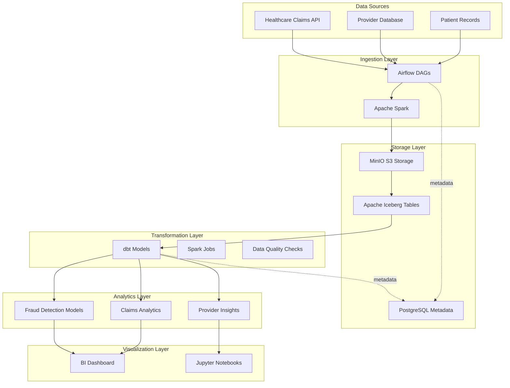

---

## Component Architecture

### Docker Services Architecture

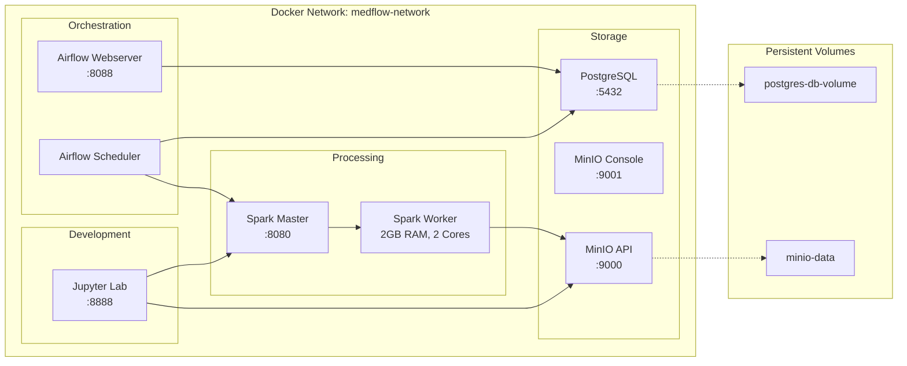

### Component Details

| Component | Image | Purpose | Resources |
|-----------|-------|---------|-----------|
| **Airflow Webserver** | apache/airflow:2.8.1 | Web UI for workflow management | 1 core |
| **Airflow Scheduler** | apache/airflow:2.8.1 | DAG scheduling and task execution | 1 core |
| **Spark Master** | bitnami/spark:3.5.0 | Distributed processing coordinator | 1 core |
| **Spark Worker** | bitnami/spark:3.5.0 | Distributed processing executor | 2 cores, 2GB RAM |
| **MinIO** | minio/minio:latest | S3-compatible object storage | Unlimited |
| **PostgreSQL** | postgres:15 | Metadata and analytics database | 1 core |
| **Jupyter Lab** | jupyter/pyspark-notebook | Interactive data exploration | 1 core |

---

## Data Flow

### End-to-End Data Pipeline

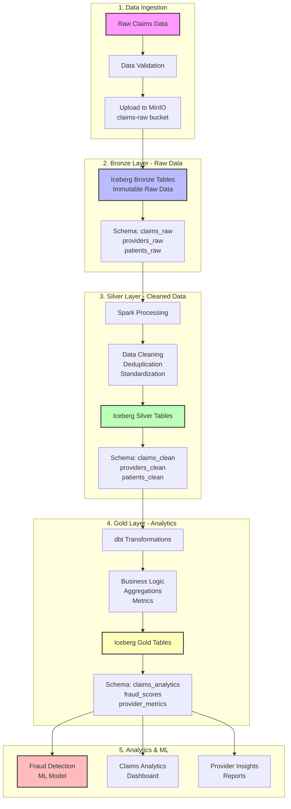

### Medallion Architecture Layers

**Bronze Layer (Raw)**
- Immutable source data
- Exact copy from source systems
- No transformations
- Full history preserved

**Silver Layer (Cleaned)**
- Validated and cleaned data
- Deduplication applied
- Standardized formats
- Business keys enforced

**Gold Layer (Analytics)**
- Business-level aggregations
- Denormalized for performance
- Metrics and KPIs
- Ready for consumption

---

## Network Architecture

### Service Communication

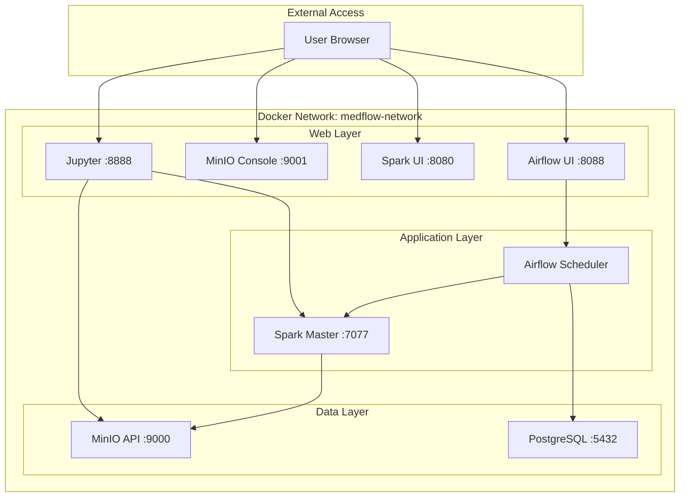

### Network Ports

| Port | Service | Protocol | Access |
|------|---------|----------|--------|
| 8088 | Airflow Web UI | HTTP | External |
| 8080 | Spark Master UI | HTTP | External |
| 9000 | MinIO API | HTTP | Internal/External |
| 9001 | MinIO Console | HTTP | External |
| 8888 | Jupyter Lab | HTTP | External |
| 5432 | PostgreSQL | TCP | Internal |
| 7077 | Spark Master | TCP | Internal |

---

## Data Lake Architecture

### MinIO Bucket Structure

```
MinIO Object Storage
│
├── claims-raw/                    # Raw ingested data
│   ├── 2024/
│   │   ├── 01/
│   │   │   ├── 01/
│   │   │   │   ├── claims_20240101_001.parquet
│   │   │   │   └── claims_20240101_002.parquet
│   │   │   └── 02/
│   │   └── 02/
│   ├── providers/
│   │   └── providers_snapshot_20240101.parquet
│   └── patients/
│       └── patients_snapshot_20240101.parquet
│
├── claims-processed/              # Transformed data
│   ├── bronze/
│   │   ├── claims/
│   │   ├── providers/
│   │   └── patients/
│   ├── silver/
│   │   ├── claims_clean/
│   │   ├── providers_clean/
│   │   └── patients_clean/
│   └── gold/
│       ├── claims_analytics/
│       ├── fraud_scores/
│       └── provider_metrics/
│
├── iceberg-warehouse/             # Iceberg metadata
│   ├── metadata/
│   │   ├── claims_raw.metadata.json
│   │   └── claims_clean.metadata.json
│   └── data/
│       ├── claims_raw/
│       └── claims_clean/
│
└── dbt-artifacts/                 # dbt outputs
    ├── manifest.json
    ├── run_results.json
    └── catalog.json
```

### Iceberg Table Architecture

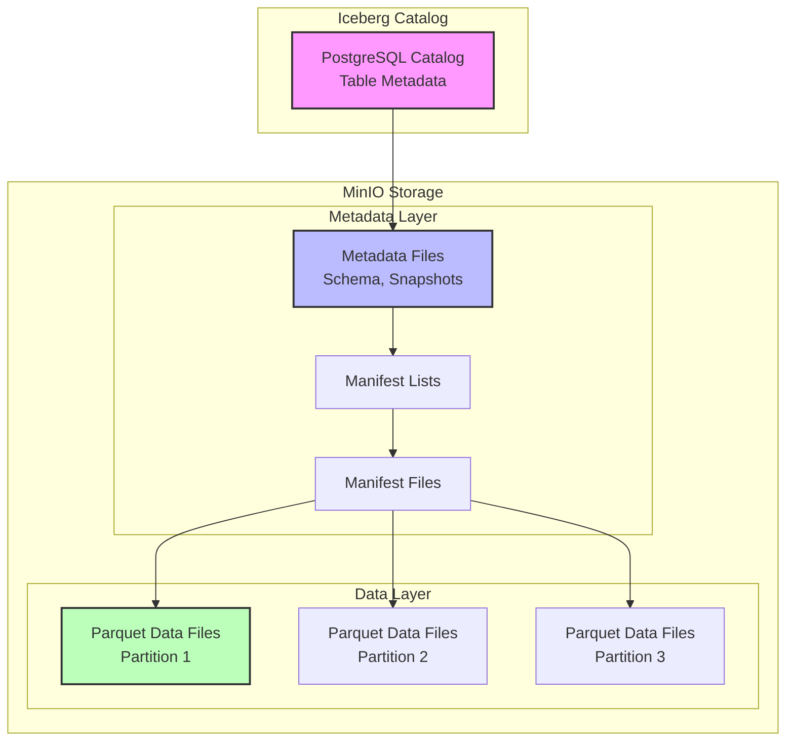

---

## Pipeline Architecture

### Airflow DAG Structure

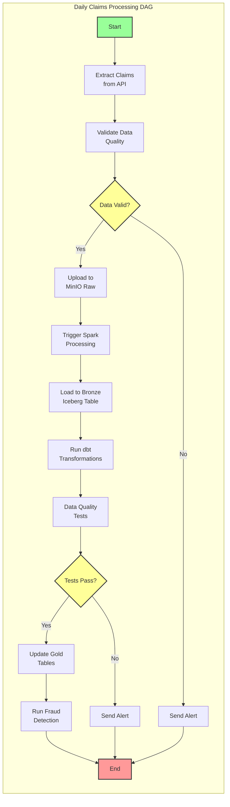

### Data Processing Flow

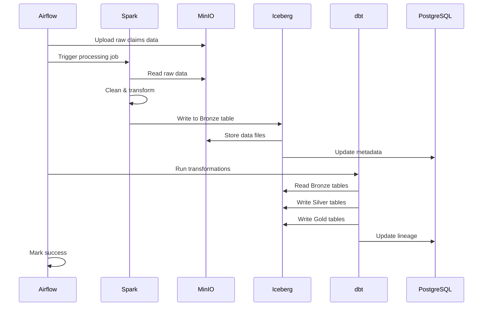

---

## Technology Stack

### Stack Overview

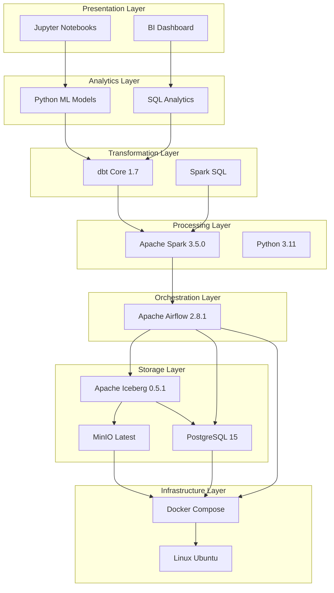

### Technology Choices & Rationale

| Component | Technology | Why Chosen |
|-----------|-----------|------------|
| **Orchestration** | Apache Airflow | Industry standard for data pipelines, visual DAG management |
| **Processing** | Apache Spark | Distributed processing, handles large datasets, integrates with Iceberg |
| **Table Format** | Apache Iceberg | ACID transactions, time travel, schema evolution, upserts |
| **Object Storage** | MinIO | S3-compatible, self-hosted, cost-effective for portfolio |
| **Transformations** | dbt | SQL-based transformations, version control, testing framework |
| **Database** | PostgreSQL | Reliable, supports Iceberg catalog, familiar SQL interface |
| **Containers** | Docker | Reproducible environments, easy deployment, isolated services |
| **Language** | Python 3.11 | Data science ecosystem, Airflow native, extensive libraries |

---

## Deployment Architecture

### Local Development Setup

```mermaid
graph TB
    subgraph "Ubuntu Server - 32GB RAM, 8 Cores"
        subgraph "Docker Host"
            D1[Docker Engine]
            D2[Docker Compose]
        end

        subgraph "Running Containers"
            C1[Airflow<br/>2 containers]
            C2[Spark<br/>2 containers]
            C3[MinIO<br/>1 container]
            C4[PostgreSQL<br/>1 container]
            C5[Jupyter<br/>1 container]
        end

        subgraph "Persistent Storage"
            V1[/var/lib/docker/volumes/<br/>postgres-db-volume]
            V2[/var/lib/docker/volumes/<br/>minio-data]
        end

        D1 --> D2
        D2 --> C1
        D2 --> C2
        D2 --> C3
        D2 --> C4
        D2 --> C5
        C4 -.-> V1
        C3 -.-> V2
    end

    subgraph "Project Directory"
        P1[~/Projects/medflow-analytics/]
        P2[dags/]
        P3[plugins/]
        P4[data/]
    end

    C1 -.mount.-> P2
    C1 -.mount.-> P3
    C1 -.mount.-> P4
```

### Resource Allocation

```
Total System Resources:
├── CPU: 8 cores @ i7
├── RAM: 32 GB
└── Disk: 50+ GB available

Allocated to Containers:
├── Airflow Webserver:     1 core,  2 GB RAM
├── Airflow Scheduler:     1 core,  2 GB RAM
├── Spark Master:          1 core,  2 GB RAM
├── Spark Worker:          2 cores, 2 GB RAM
├── MinIO:                 1 core,  2 GB RAM
├── PostgreSQL:            1 core,  2 GB RAM
├── Jupyter:               1 core,  2 GB RAM
└── Reserved for OS:       2 cores, 18 GB RAM
```

### Volume Mounts

```
Host Directory                              Container Mount
─────────────────────────────────────────────────────────────────
~/Projects/medflow-analytics/dags/      →  /opt/airflow/dags
~/Projects/medflow-analytics/plugins/   →  /opt/airflow/plugins
~/Projects/medflow-analytics/config/    →  /opt/airflow/config
~/Projects/medflow-analytics/data/      →  /opt/airflow/data
~/Projects/medflow-analytics/logs/      →  /opt/airflow/logs
~/Projects/medflow-analytics/scripts/   →  /opt/airflow/scripts
~/Projects/medflow-analytics/notebooks/ →  /home/jovyan/work
```

---

## Data Models

### Entity Relationship Diagram

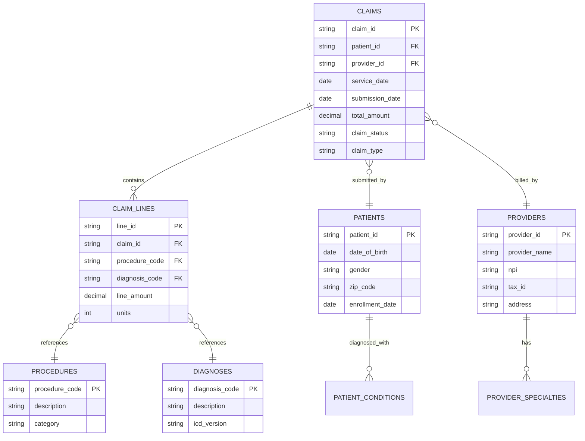

---

## Security Architecture

### Access Control

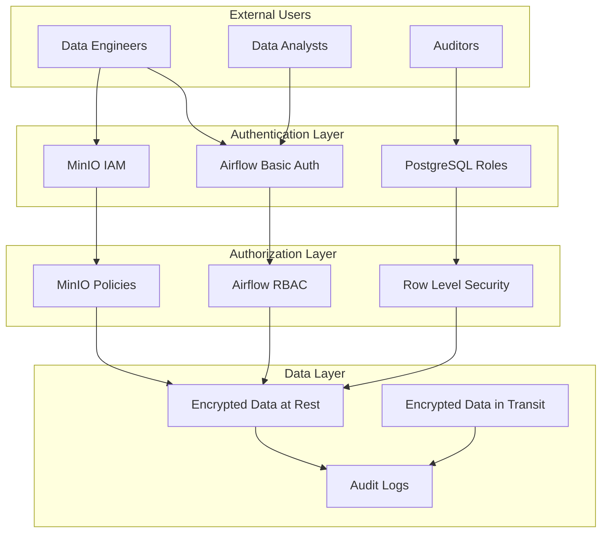

### Security Layers

1. **Network Security**
   - Docker network isolation
   - Port exposure control
   - Internal service communication

2. **Application Security**
   - Airflow authentication (basic auth)
   - MinIO access keys
   - PostgreSQL password authentication

3. **Data Security**
   - PHI data anonymization
   - Encryption at rest (volume encryption)
   - Encryption in transit (TLS for production)

4. **Compliance**
   - HIPAA-compliant architecture (with additional hardening)
   - Audit logging
   - Data lineage tracking

---

## Monitoring & Observability

### Monitoring Architecture

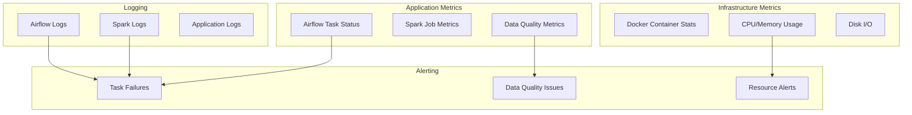

### Key Metrics to Monitor

**Pipeline Metrics:**
- DAG success/failure rate
- Task execution duration
- Data processing volume
- Data quality check results

**System Metrics:**
- Container health status
- CPU and memory utilization
- Disk space usage
- Network throughput

**Business Metrics:**
- Claims processed per day
- Fraud detection rate
- Data freshness
- SLA compliance

---

## Scalability Considerations

### Horizontal Scaling

```
Current Setup (Local Dev):
└── 1 Spark Worker (2 cores, 2GB)

Production Scaling:
├── 5 Spark Workers (4 cores, 8GB each)
├── Multiple Airflow Workers
└── Read Replicas for PostgreSQL
```

### Vertical Scaling

```
Component            Current    Production
─────────────────────────────────────────
Spark Worker Memory  2 GB       16 GB
Spark Worker Cores   2          8
PostgreSQL Memory    2 GB       32 GB
MinIO Cluster        Single     Multi-node
```

### Future Enhancements

1. **Kubernetes Migration**
   - Container orchestration
   - Auto-scaling
   - High availability

2. **Cloud Deployment**
   - AWS S3 instead of MinIO
   - AWS Glue/EMR instead of self-hosted Spark
   - Managed Airflow (MWAA)

3. **Performance Optimization**
   - Iceberg partition optimization
   - Query result caching
   - Materialized views

---

## Appendix

### Glossary

- **DAG**: Directed Acyclic Graph - Airflow workflow definition
- **Iceberg**: Open table format for huge analytic datasets
- **Medallion**: Bronze/Silver/Gold data architecture pattern
- **MinIO**: S3-compatible object storage
- **dbt**: Data build tool for transformations
- **HIPAA**: Health Insurance Portability and Accountability Act

### References

- [Apache Airflow Documentation](https://airflow.apache.org/docs/)
- [Apache Spark Documentation](https://spark.apache.org/docs/latest/)
- [Apache Iceberg Documentation](https://iceberg.apache.org/)
- [MinIO Documentation](https://min.io/docs/)
- [dbt Documentation](https://docs.getdbt.com/)

---

**Document Version:** 1.0
**Last Updated:** December 2024
**Project:** MedFlow Analytics
**Architecture Type:** Data Lakehouse with Medallion Pattern
