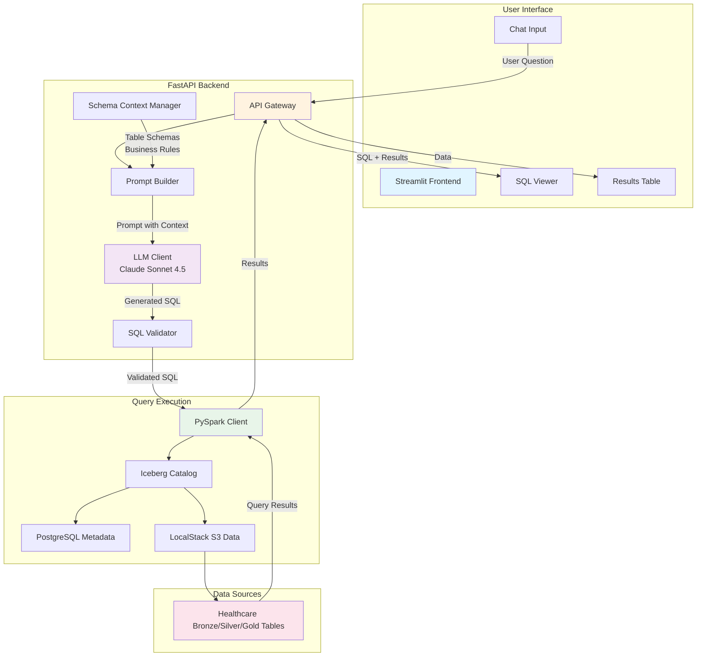

# Phase 1: Text-to-SQL RAG Architecture (MVP)

## Overview
Simple text-to-SQL pipeline with Claude API for natural language query conversion.

## Architecture Diagram



## Component Details

### Frontend (Streamlit)
- **Purpose**: Rapid prototyping, interactive chat interface
- **Features**:
  - Chat input box
  - SQL query display with syntax highlighting
  - Results table display
  - Session-based chat history

### Backend (FastAPI)
- **Prompt Builder**: Constructs LLM prompts with table schemas and business rules
- **LLM Client**: Claude Sonnet 4.5 API integration via LangChain
- **SQL Validator**: Safety checks (no DROP/DELETE), syntax validation, LIMIT enforcement
- **Schema Context Manager**: Loads table metadata, column descriptions, business rules

### Query Execution (PySpark)
- **Connection**: Direct to existing Iceberg catalog
- **Execution**: Runs validated SQL against Gold/Silver tables
- **Format**: Returns results as JSON/dict for frontend display

## Data Flow

1. **User Input**: "What's the average claim amount by payer in Q4 2024?"
2. **Context Retrieval**: Load schemas for relevant tables (claims_monthly_summary)
3. **Prompt Construction**:
   ```
   You are a SQL expert for healthcare analytics.
   Tables: [schema details]
   Question: What's the average claim amount by payer in Q4 2024?
   Generate SQL:
   ```
4. **SQL Generation**: Claude generates optimized SQL
5. **Validation**: Check for safety, add LIMIT if missing
6. **Execution**: Run via PySpark against Iceberg
7. **Response**: Display SQL + results + explanation

## Technology Stack

| Component | Technology | Purpose |
|-----------|-----------|---------|
| Frontend | Streamlit | Rapid UI development |
| Backend | FastAPI | RESTful API server |
| LLM | Claude Sonnet 4.5 | SQL generation |
| Orchestration | LangChain | LLM prompt management |
| Query Engine | PySpark | Iceberg query execution |
| Storage | Iceberg + S3 | Table format + object storage |

## Expected Performance

- **Query Latency**: 3-8 seconds (LLM: 2-5s, Spark: 1-3s)
- **Accuracy**: 70-80% correct SQL on first try
- **Cost**: ~$0.01-0.05 per query (Claude API)

## Limitations (Phase 1)

❌ No semantic understanding of domain terms (ICD codes, CPT codes)
❌ No example-based learning
❌ No query caching
❌ No multi-turn conversations
❌ No error recovery (if SQL fails, manual retry)

## Success Criteria

✅ Can answer 10 pre-defined questions correctly
✅ End-to-end latency < 10 seconds
✅ SQL passes validation 100% of time
✅ Results display correctly in frontend
✅ Chat history persists in session

## Next Phase Evolution

Phase 2 will add:
- Vector store for semantic search
- Healthcare domain glossary
- Example query retrieval
- Improved accuracy (target 90%+)
