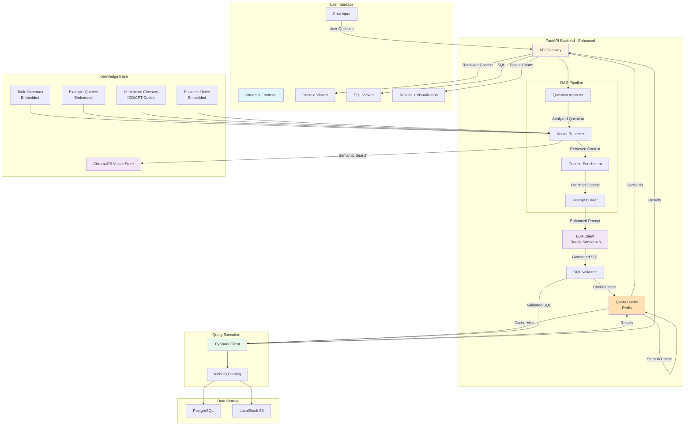

# Phase 2: Vector Store + Semantic RAG Architecture

## Overview
Enhanced RAG system with vector store for semantic search and domain-specific context retrieval.

## Architecture Diagram



## New Components (vs Phase 1)

### 1. Question Analyzer
```python
# Extracts key entities and intent
{
  "entities": ["diabetes", "Q4 2024", "average claim amount"],
  "intent": "aggregation",
  "complexity": "medium",
  "tables_likely": ["claims_monthly_summary", "claims_clean"]
}
```

### 2. Vector Retriever (ChromaDB)
- **Embedding Model**: OpenAI text-embedding-3-small (1536 dims) or HuggingFace all-MiniLM-L6-v2 (384 dims)
- **Content Indexed**:
  - Table schemas with descriptions
  - 50+ example question-SQL pairs
  - Healthcare terminology (ICD-10, CPT codes)
  - Business rule definitions
- **Retrieval**: Top-k similarity search (k=5)

### 3. Context Enrichment
```python
# Combines retrieved context into structured format
{
  "relevant_tables": [...],
  "similar_examples": [...],
  "domain_terms": {
    "diabetes": "ICD-10: E11.x - Type 2 diabetes mellitus"
  },
  "business_rules": [...]
}
```

### 4. Query Cache (Redis)
- **Key**: Hash of (SQL query + params)
- **Value**: Query results + metadata
- **TTL**: 1 hour for aggregations, 5 minutes for detail queries
- **Benefits**:
  - Reduce LLM API costs
  - Faster response for repeated questions
  - Analytics on common queries

## Knowledge Base Structure

### Table Schemas (Embedded)
```json
{
  "table": "healthcare.claims_clean",
  "description": "Validated healthcare claims from all payers after quality checks",
  "columns": {
    "claim_id": "Unique identifier for each claim",
    "patient_id": "De-identified patient ID",
    "diagnosis_code": "ICD-10 diagnosis code (e.g., E11.9 for Type 2 diabetes)",
    ...
  }
}
```

### Example Queries (Embedded)
```json
{
  "question": "What's the approval rate for diabetes claims by payer?",
  "sql": "SELECT payer, COUNT(*) as total_claims, ...",
  "explanation": "Filters for diabetes ICD codes (E11.x), calculates approval rate",
  "complexity": "medium"
}
```

### Healthcare Glossary (Embedded)
```json
{
  "term": "diabetes",
  "icd10_codes": ["E11.9", "E11.0", "E11.1"],
  "description": "Type 2 diabetes mellitus with various complications",
  "common_procedures": ["99213", "99214"]
}
```

## Enhanced Data Flow

1. **User Input**: "Show me high-cost diabetes claims from BlueCross"

2. **Question Analysis**:
   - Entities: ["diabetes", "BlueCross", "high-cost"]
   - Intent: Filtering + sorting

3. **Vector Retrieval** (top 5 results):
   - Similar question: "What are expensive claims for Aetna?"
   - Domain term: "diabetes = ICD-10 E11.x"
   - Business rule: "high_value_claims: claim_amount > 10000"
   - Relevant table: claims_clean

4. **Context Enrichment**:
   ```
   Relevant Context:
   - Use table: healthcare.claims_clean
   - Filter: payer = 'BlueCross' AND diagnosis_code LIKE 'E11%'
   - High-cost defined as: claim_amount > 10000
   - Example SQL: [similar query]
   ```

5. **Enhanced Prompt**: (Previous prompt + enriched context)

6. **SQL Generation**: More accurate, domain-aware SQL

7. **Cache Check**: Hash SQL, check Redis

8. **Execution**: Run if cache miss, store result

9. **Response**: SQL + context + results + suggested follow-ups

## Technology Stack Updates

| Component | Technology | Change from Phase 1 |
|-----------|-----------|---------------------|
| Vector Store | ChromaDB | NEW |
| Embeddings | OpenAI / HuggingFace | NEW |
| Cache | Redis | NEW |
| Visualization | Plotly/Altair | NEW |
| Frontend | Streamlit | Enhanced |

## Performance Improvements

| Metric | Phase 1 | Phase 2 | Improvement |
|--------|---------|---------|-------------|
| SQL Accuracy | 70-80% | 85-92% | +15% |
| Avg Latency | 5-8s | 3-6s (w/ cache) | -40% |
| Domain Term Handling | Poor | Excellent | Major |
| Cache Hit Rate | 0% | 30-50% | N/A |
| Cost per Query | $0.03 | $0.02 (w/ cache) | -33% |

## Expected Capabilities

✅ Understands healthcare terminology (ICD, CPT codes)
✅ Learns from example queries
✅ Caches frequent queries
✅ Better handling of ambiguous questions
✅ Suggested follow-up questions based on context
✅ Simple data visualizations (bar charts, line graphs)

## New Limitations

❌ Still single-turn (no conversation memory)
❌ No error recovery/self-healing
❌ No query optimization feedback
❌ Manual knowledge base updates

## Success Criteria

✅ 90%+ accuracy on 50 test questions
✅ Correct ICD/CPT code mapping
✅ 30%+ cache hit rate after 1 hour usage
✅ Sub-5s latency for cached queries
✅ Auto-visualization of numeric results

## Cost Analysis

### Embedding Costs (One-time Setup)
- 500 documents × 500 tokens avg = 250K tokens
- OpenAI: $0.00002/1K tokens = **$0.005** (negligible)
- OR HuggingFace: **$0** (local)

### Query Costs (Per Query)
- Question embedding: ~100 tokens = $0.000002
- Vector search: Free (ChromaDB local)
- LLM generation: ~$0.02 (same as Phase 1)
- **Total: ~$0.02 per query**

### Cache Savings
- 30% cache hit rate = 30% cost reduction
- **Effective cost: ~$0.014 per query**

## Next Phase Evolution

Phase 3 will add:
- Multi-agent system (planning, execution, validation)
- Conversation memory (multi-turn dialogues)
- Self-healing queries (auto-retry on errors)
- Query optimization agent
- Advanced explainability
