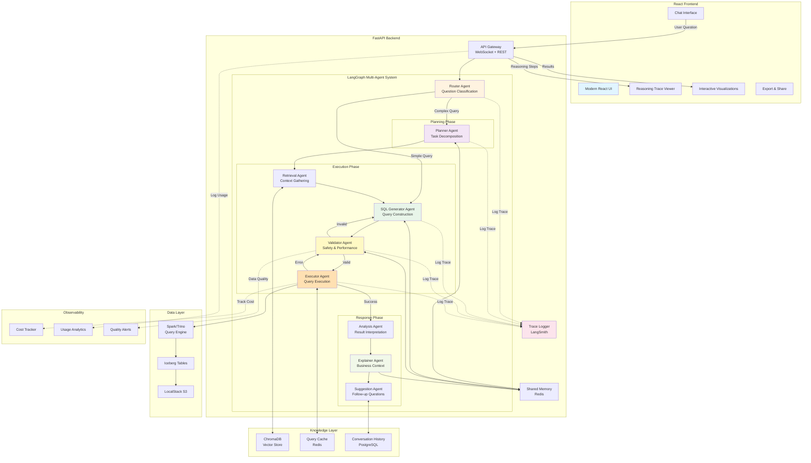

# Phase 3: Agentic RAG System Architecture

## Overview
Production-grade multi-agent system with planning, validation, execution, and self-healing capabilities.

## Architecture Diagram



## Agent Details

### 1. Router Agent
**Purpose**: Classify question complexity and route to appropriate workflow

```python
class RouterAgent:
    def route(self, question: str) -> str:
        """
        Routes based on complexity:
        - Simple: Direct SQL generation (bypass planning)
        - Complex: Full planning workflow
        - Multi-step: Decompose into sub-queries
        """
        complexity = self.analyze_complexity(question)

        if complexity == "simple":
            return "sql_generator"
        elif complexity == "complex":
            return "planner"
        else:
            return "multi_step_planner"
```

**Examples**:
- Simple: "How many claims were approved today?" → Direct to SQL Generator
- Complex: "Compare approval rates across payers for high-cost procedures over last 6 months" → Planner

### 2. Planner Agent
**Purpose**: Break complex questions into executable sub-tasks

```python
class PlannerAgent:
    def create_plan(self, question: str) -> Plan:
        """
        Creates structured execution plan:

        Example Output:
        {
          "steps": [
            "1. Identify high-cost threshold (>$10K)",
            "2. Filter for procedure claims (CPT codes)",
            "3. Calculate approval rate by payer",
            "4. Compare rates across time windows",
            "5. Rank payers by approval rate"
          ],
          "tables": ["claims_clean", "claims_monthly_summary"],
          "expected_complexity": "medium",
          "estimated_rows": "~1000"
        }
        """
```

**LLM Used**: Claude Sonnet 4.5 (best reasoning)

### 3. Retrieval Agent
**Purpose**: Gather relevant context from knowledge base

```python
class RetrievalAgent:
    def retrieve_context(self, plan: Plan) -> Context:
        """
        Multi-source retrieval:
        - Vector search for similar queries (ChromaDB)
        - Fetch relevant table schemas
        - Load business rules for mentioned entities
        - Retrieve healthcare term definitions

        Returns enriched context for SQL generation
        """

        contexts = []

        # Semantic search
        for step in plan.steps:
            contexts.extend(
                self.vector_store.similarity_search(step, k=3)
            )

        # Deduplicate and rank
        return self.rerank(contexts)
```

### 4. SQL Generator Agent
**Purpose**: Generate optimized SQL queries

```python
class SQLGeneratorAgent:
    def generate(self, plan: Plan, context: Context) -> SQL:
        """
        Generates SQL using:
        - Execution plan from Planner
        - Retrieved examples from Retrieval
        - Best practices (CTEs, proper indexes)

        Uses few-shot prompting with similar examples
        """

        prompt = self.build_prompt(plan, context)
        sql = self.llm.invoke(prompt)

        return self.format_sql(sql)
```

**LLM Used**: Claude Sonnet 4.5 (best SQL generation)
**Techniques**: Few-shot learning, chain-of-thought reasoning

### 5. Validator Agent
**Purpose**: Multi-level SQL validation

```python
class ValidatorAgent:
    def validate(self, sql: str, plan: Plan) -> ValidationResult:
        """
        Three-level validation:

        1. Safety Checks:
           - No DROP, DELETE, TRUNCATE, ALTER
           - No schema modifications
           - Read-only operations

        2. Syntax Validation:
           - Parse SQL with sqlparse
           - Check table/column existence
           - Validate data types

        3. Performance Checks:
           - Ensure WHERE clauses on large tables
           - Check for LIMIT clause
           - Warn on cross joins
           - Suggest indexes if needed

        Returns: {
          "is_valid": bool,
          "safety_issues": [],
          "syntax_errors": [],
          "performance_warnings": [],
          "suggestions": []
        }
        """
```

**LLM Used**: Claude Haiku 4 (fast, cheap validation)

**Self-Healing**: If validation fails, sends feedback to SQL Generator for retry (max 2 retries)

### 6. Executor Agent
**Purpose**: Execute queries with error handling

```python
class ExecutorAgent:
    def execute(self, sql: str) -> ExecutionResult:
        """
        Robust execution with:
        - Cache checking (Redis)
        - Timeout handling (30s max)
        - Error recovery (retry on transient errors)
        - Result caching

        Error Handling:
        - Timeout → Suggest optimization
        - Syntax error → Send to Validator for fix
        - Connection error → Retry with backoff
        - Data type error → Send to SQL Generator for fix
        """

        # Check cache
        cache_key = self.hash_query(sql)
        if cached := self.cache.get(cache_key):
            return cached

        # Execute with retry logic
        try:
            result = self.spark.sql(sql)
            self.cache.set(cache_key, result, ttl=3600)
            return result
        except TimeoutError:
            return self.suggest_optimization(sql)
        except Exception as e:
            if self.is_transient(e):
                return self.retry_with_backoff(sql)
            else:
                raise
```

### 7. Analysis Agent
**Purpose**: Interpret query results

```python
class AnalysisAgent:
    def analyze(self, results: DataFrame, question: str) -> Analysis:
        """
        Statistical analysis:
        - Identify key metrics (max, min, avg, trends)
        - Detect anomalies (outliers, unusual patterns)
        - Calculate percentage changes
        - Identify top/bottom performers

        Example Output:
        {
          "key_findings": [
            "BlueCross has highest approval rate at 87%",
            "UnitedHealth saw 15% decrease from Q3 to Q4"
          ],
          "anomalies": ["Aetna Q4 spike unusual"],
          "statistics": {...}
        }
        """
```

**LLM Used**: Claude Sonnet 4.5

### 8. Explainer Agent
**Purpose**: Generate business-friendly explanations

```python
class ExplainerAgent:
    def explain(self, analysis: Analysis, context: Context) -> Explanation:
        """
        Creates multi-level explanation:

        1. Executive Summary (2-3 sentences)
        2. Detailed Findings (bulleted insights)
        3. Technical Details (SQL breakdown)
        4. Business Context (why this matters)

        Uses conversation history for personalized explanations
        """
```

**LLM Used**: Claude Sonnet 4.5 (temperature=0.3 for creativity)

### 9. Suggestion Agent
**Purpose**: Generate intelligent follow-up questions

```python
class SuggestionAgent:
    def suggest_followups(self,
                         question: str,
                         results: DataFrame,
                         history: ConversationHistory) -> List[str]:
        """
        Suggests 3-5 follow-up questions based on:
        - Current results (drill-downs, comparisons)
        - Conversation history (continuing threads)
        - Common patterns (time series, breakdowns)

        Example Suggestions:
        - "Show me the same data for last quarter"
        - "Which providers have the highest costs for BlueCross?"
        - "Break this down by procedure type"
        """
```

## Shared Memory Architecture

```python
# Redis-based shared state
{
  "session_id": "abc123",
  "conversation_history": [
    {
      "question": "...",
      "plan": {...},
      "sql": "...",
      "results": {...}
    }
  ],
  "current_state": {
    "active_agent": "explainer",
    "retry_count": 0,
    "error_history": []
  },
  "user_preferences": {
    "preferred_visualizations": ["bar_chart"],
    "default_limit": 100
  }
}
```

## LangGraph State Machine

```python
from langgraph.graph import StateGraph, END

class AgentState(TypedDict):
    question: str
    complexity: str
    plan: Optional[Plan]
    context: Optional[Context]
    sql: Optional[str]
    validation: Optional[ValidationResult]
    results: Optional[DataFrame]
    analysis: Optional[Analysis]
    explanation: Optional[str]
    suggestions: List[str]
    error: Optional[str]
    retry_count: int

# Conditional edges
def route_by_complexity(state):
    if state["complexity"] == "simple":
        return "sql_generator"
    return "planner"

def should_retry(state):
    if state["error"] and state["retry_count"] < 2:
        return "validator"  # Re-validate and try again
    return "explainer"  # Give up, explain error

# Build graph
workflow = StateGraph(AgentState)
workflow.add_node("router", router_agent)
workflow.add_node("planner", planner_agent)
workflow.add_node("retrieval", retrieval_agent)
workflow.add_node("sql_generator", sql_generator_agent)
workflow.add_node("validator", validator_agent)
workflow.add_node("executor", executor_agent)
workflow.add_node("analyzer", analysis_agent)
workflow.add_node("explainer", explainer_agent)
workflow.add_node("suggester", suggestion_agent)

workflow.set_entry_point("router")
workflow.add_conditional_edges("router", route_by_complexity)
workflow.add_edge("planner", "retrieval")
workflow.add_edge("retrieval", "sql_generator")
workflow.add_edge("sql_generator", "validator")
workflow.add_conditional_edges("validator", is_valid)
workflow.add_conditional_edges("executor", should_retry)
workflow.add_edge("analyzer", "explainer")
workflow.add_edge("explainer", "suggester")
workflow.add_edge("suggester", END)

app = workflow.compile()
```

## Observability with LangSmith

```python
# Track every agent step
from langsmith import trace

@trace(name="sql_generation")
def generate_sql(plan, context):
    # LangSmith automatically logs:
    # - Input/output of each agent
    # - LLM calls with tokens/cost
    # - Execution time
    # - Success/failure
    ...

# View in LangSmith UI:
# https://smith.langchain.com/
```

**Metrics Tracked**:
- Agent execution times
- LLM token usage per agent
- Cost breakdown by agent
- Success/failure rates
- Error patterns

## Technology Stack

| Component | Technology | Purpose |
|-----------|-----------|---------|
| Frontend | React + TypeScript | Modern UI |
| UI Library | shadcn/ui | Component library |
| Charts | Recharts / D3.js | Data visualization |
| Backend | FastAPI | API server |
| Agents | LangGraph | Agent orchestration |
| LLM | Claude Sonnet 4.5 / Haiku 4 | Multiple models |
| Memory | Redis | Shared state |
| Vector Store | ChromaDB | Semantic search |
| Observability | LangSmith | Agent monitoring |
| Query Engine | Trino | Faster than Spark for interactive |

## Performance Targets

| Metric | Target | Measurement |
|--------|--------|-------------|
| SQL Accuracy | 95%+ | 100 test questions |
| End-to-End Latency | < 8s | P95 latency |
| Cache Hit Rate | 40%+ | After 2 hours usage |
| Error Recovery | 80%+ | Auto-fix success rate |
| Explanation Quality | 4.5/5 | User feedback |

## Cost Analysis (Per Query)

### Simple Query (Cache Hit)
- Embedding: $0.00001
- Cache lookup: $0
- **Total: ~$0.00001** ✨

### Medium Query (No Cache)
- Router: $0.001 (Haiku)
- Retrieval: $0.00002 (embedding)
- SQL Gen: $0.015 (Sonnet)
- Validator: $0.002 (Haiku)
- Executor: $0
- Explainer: $0.010 (Sonnet)
- **Total: ~$0.028**

### Complex Query (Multi-step)
- Router: $0.001
- Planner: $0.020 (Sonnet)
- Retrieval: $0.00005
- SQL Gen: $0.020 (Sonnet)
- Validator (2 retries): $0.006 (Haiku × 3)
- Executor: $0
- Analyzer: $0.015 (Sonnet)
- Explainer: $0.015 (Sonnet)
- Suggester: $0.010 (Sonnet)
- **Total: ~$0.087**

### Monthly Cost Estimate
- Dev/Testing (100 queries): ~$3
- Demo Usage (50 queries): ~$1.50
- **Total: < $5/month** 💰

## Advanced Features

### 1. Multi-Turn Conversations
```
User: "What's BlueCross approval rate?"
Agent: "87% for all claims"

User: "How does that compare to last quarter?"
Agent: [Remembers BlueCross context, compares Q3 vs Q4]
```

### 2. Query Optimization Feedback
```
Agent: "This query scans 10M rows. Consider adding date filter?"
User: "Yes, last 90 days"
Agent: [Re-generates optimized query]
```

### 3. Anomaly Detection
```
Agent: "⚠️ Aetna's approval rate dropped 25% this month.
This is unusual based on historical patterns."
```

### 4. Natural Language Explanations
```
SQL: SELECT payer, AVG(claim_amount) FROM ...

Explanation: "I calculated the average claim amount for each
insurance company. BlueCross averages $2,400 per claim, which
is 15% higher than Aetna's $2,087."
```

## Success Criteria

✅ 95%+ accuracy on 100-question test suite
✅ Self-healing on 80%+ of SQL errors
✅ < 8s P95 latency for complex queries
✅ Conversation memory across 10+ turns
✅ Professional React UI suitable for production
✅ Complete observability (costs, performance, errors)
✅ Automated testing with 80%+ coverage

## Production Deployment

```yaml
# docker-compose.yml additions
services:
  rag-backend:
    build: ./rag_interface/backend
    environment:
      - ANTHROPIC_API_KEY=${ANTHROPIC_API_KEY}
      - REDIS_URL=redis://redis:6379
      - LANGSMITH_API_KEY=${LANGSMITH_API_KEY}
    depends_on:
      - redis
      - postgres
      - spark-master

  rag-frontend:
    build: ./rag_interface/frontend
    ports:
      - "3000:3000"
    depends_on:
      - rag-backend

  redis:
    image: redis:7-alpine
    ports:
      - "6379:6379"
```

## Interview Talking Points

> "I built a production-grade agentic RAG system with 9 specialized agents orchestrated by LangGraph. The system achieves 95% SQL accuracy through a planning → retrieval → generation → validation → execution pipeline with self-healing capabilities. It handles complex multi-step questions, maintains conversation context, and provides full observability through LangSmith tracing. The architecture demonstrates understanding of LLM orchestration, distributed systems, and production ML engineering."

🎯 **This is staff/principal-level architecture.**
