# MedFlow Analytics: Complete System Architecture

## Overview
End-to-end healthcare analytics platform combining medallion data pipeline with AI-powered natural language query interface.

## Full System Architecture

```mermaid
graph TB
    subgraph "Data Sources"
        CSV1[BlueCross Claims CSV]
        CSV2[Aetna Claims CSV]
        CSV3[UnitedHealth Claims CSV]
    end

    subgraph "Storage Layer"
        S3[LocalStack S3<br/>Raw Data Storage]
    end

    subgraph "Data Pipeline - Airflow Orchestrated"
        subgraph "Bronze Layer"
            BRONZE[Bronze Ingestion<br/>Raw CSV → Iceberg]
            VERIFY_B[Verify Bronze]
        end

        subgraph "Silver Layer"
            SILVER[Silver Transformation<br/>Schema Standardization]
            VERIFY_S[Verify Silver]
            QUALITY[Data Quality Gate<br/>Quarantine Check]
        end

        subgraph "Gold Layer"
            GOLD[Gold Aggregation<br/>Business Metrics]
            VERIFY_G[Verify Gold]
        end
    end

    subgraph "Data Storage - Apache Iceberg"
        CATALOG[PostgreSQL<br/>Iceberg Catalog]

        subgraph "Bronze Tables"
            B_TABLE[healthcare.claims_raw]
        end

        subgraph "Silver Tables"
            S_TABLE1[healthcare.claims_clean]
            S_TABLE2[healthcare.claims_quarantined]
            S_TABLE3[healthcare.data_quality_log]
        end

        subgraph "Gold Tables"
            G_TABLE1[healthcare_gold.claims_monthly_summary]
            G_TABLE2[healthcare_gold.claims_approval_funnel]
            G_TABLE3[healthcare_gold.provider_performance]
        end
    end

    subgraph "Query Processing"
        SPARK[Apache Spark Cluster<br/>Master + Worker]
        TRINO[Trino Query Engine<br/>Phase 3]
    end

    subgraph "AI Query Interface - RAG System"
        direction TB

        subgraph "Frontend Layer"
            UI_P1[Streamlit App<br/>Phase 1-2]
            UI_P3[React App<br/>Phase 3]
        end

        subgraph "Backend - FastAPI"
            API[API Gateway]

            subgraph "Phase 1: Basic RAG"
                PROMPT[Prompt Builder]
                LLM1[Claude API]
                VALID[SQL Validator]
            end

            subgraph "Phase 2: Enhanced RAG"
                VECTOR[ChromaDB<br/>Vector Store]
                CACHE[Redis Cache]
                RETRIEVE[Context Retrieval]
            end

            subgraph "Phase 3: Agentic RAG"
                AGENTS[LangGraph Agents<br/>9 Specialized Agents]
                MEMORY[Shared Memory<br/>Redis]
                TRACE[LangSmith<br/>Observability]
            end
        end

        subgraph "Knowledge Base"
            KB1[Table Schemas]
            KB2[Example Queries]
            KB3[Healthcare Glossary]
            KB4[Business Rules]
        end
    end

    subgraph "Orchestration"
        AIRFLOW[Apache Airflow<br/>Scheduler + Webserver]
        DOCKER[Docker Compose<br/>Infrastructure]
    end

    subgraph "Users"
        ANALYST[Data Analysts]
        BUSINESS[Business Users]
        DATA_ENG[Data Engineers]
    end

    %% Data Flow: Ingestion Pipeline
    CSV1 --> S3
    CSV2 --> S3
    CSV3 --> S3

    AIRFLOW -->|Trigger| BRONZE
    BRONZE -->|via Spark| SPARK
    SPARK -->|Write| B_TABLE
    B_TABLE --> S3
    BRONZE --> VERIFY_B
    VERIFY_B --> SILVER

    SILVER -->|via Spark| SPARK
    SPARK -->|Write| S_TABLE1
    SPARK -->|Write| S_TABLE2
    SPARK -->|Write| S_TABLE3
    S_TABLE1 --> S3
    S_TABLE2 --> S3
    S_TABLE3 --> S3
    SILVER --> VERIFY_S
    VERIFY_S --> QUALITY
    QUALITY --> GOLD

    GOLD -->|via Spark| SPARK
    SPARK -->|Write| G_TABLE1
    SPARK -->|Write| G_TABLE2
    SPARK -->|Write| G_TABLE3
    G_TABLE1 --> S3
    G_TABLE2 --> S3
    G_TABLE3 --> S3
    GOLD --> VERIFY_G

    %% Catalog Management
    B_TABLE -.->|Metadata| CATALOG
    S_TABLE1 -.->|Metadata| CATALOG
    S_TABLE2 -.->|Metadata| CATALOG
    S_TABLE3 -.->|Metadata| CATALOG
    G_TABLE1 -.->|Metadata| CATALOG
    G_TABLE2 -.->|Metadata| CATALOG
    G_TABLE3 -.->|Metadata| CATALOG

    %% RAG Query Flow
    BUSINESS -->|Natural Language| UI_P1
    BUSINESS -->|Natural Language| UI_P3
    ANALYST -->|Questions| UI_P1
    ANALYST -->|Questions| UI_P3

    UI_P1 --> API
    UI_P3 --> API

    API --> PROMPT
    PROMPT --> LLM1

    API --> RETRIEVE
    RETRIEVE --> VECTOR
    VECTOR --> KB1
    VECTOR --> KB2
    VECTOR --> KB3
    VECTOR --> KB4

    API --> AGENTS
    AGENTS <--> MEMORY
    AGENTS -.->|Trace| TRACE

    LLM1 --> VALID
    AGENTS --> VALID
    VALID -->|Execute SQL| SPARK
    VALID -->|Execute SQL| TRINO

    SPARK --> CATALOG
    TRINO --> CATALOG
    CATALOG --> S3

    SPARK -->|Results| CACHE
    TRINO -->|Results| CACHE
    CACHE -->|Cached Results| API

    API -->|Results + Explanation| UI_P1
    API -->|Results + Viz| UI_P3

    %% Pipeline Monitoring
    DATA_ENG -->|Monitor| AIRFLOW
    DATA_ENG -->|Debug| TRACE

    %% Infrastructure
    DOCKER -->|Manages| AIRFLOW
    DOCKER -->|Manages| SPARK
    DOCKER -->|Manages| S3
    DOCKER -->|Manages| CATALOG
    DOCKER -->|Manages| API
    DOCKER -->|Manages| CACHE

    style CSV1 fill:#e3f2fd
    style CSV2 fill:#e3f2fd
    style CSV3 fill:#e3f2fd
    style S3 fill:#fff3e0
    style BRONZE fill:#f3e5f5
    style SILVER fill:#e8f5e9
    style GOLD fill:#fff9c4
    style AGENTS fill:#fce4ec
    style UI_P3 fill:#e1f5ff
    style CATALOG fill:#ffe0b2
```



## System Components

### 1. Data Ingestion Pipeline (Airflow Orchestrated)
- **Bronze Layer**: Raw data ingestion from S3 to Iceberg
- **Silver Layer**: Multi-payer schema standardization with data quality validation
- **Gold Layer**: Business-ready aggregation tables

### 2. Storage Layer
- **LocalStack S3**: AWS S3 emulation for cloud-native development
- **Apache Iceberg**: Table format with ACID transactions, time travel, schema evolution
- **PostgreSQL**: Iceberg catalog metadata storage

### 3. Query Processing
- **Apache Spark**: Distributed batch processing for pipeline
- **Trino** (Phase 3): Interactive query engine for RAG interface

### 4. AI Query Interface
- **Phase 1**: Text-to-SQL with Claude API
- **Phase 2**: Enhanced with vector store and caching
- **Phase 3**: Multi-agent system with full observability

### 5. Orchestration
- **Airflow**: Pipeline scheduling and monitoring
- **Docker Compose**: Infrastructure management

## Data Flow Scenarios

### Scenario 1: Daily Pipeline Execution
```
1. Airflow triggers Bronze ingestion (scheduled)
2. Spark reads CSV from S3 → writes to Iceberg
3. Bronze verification checks row counts
4. Silver transformation standardizes schemas
5. Data quality gate validates quarantine rate < 10%
6. Gold aggregation creates business metrics
7. All tables registered in Iceberg catalog
```

### Scenario 2: Natural Language Query
```
User: "What's the average claim amount for diabetes patients?"

Phase 1 Flow:
1. Streamlit frontend captures question
2. FastAPI receives question
3. Prompt builder adds table schemas
4. Claude generates SQL
5. Validator checks safety
6. Spark executes query
7. Results returned to user

Phase 3 Flow:
1. React frontend captures question
2. Router agent classifies complexity
3. Planner agent decomposes question
4. Retrieval agent gathers context from vector store
5. SQL generator creates optimized query
6. Validator checks performance + safety
7. Executor runs via Trino (faster)
8. Analyzer interprets results
9. Explainer provides business context
10. Suggester generates follow-ups
11. Results + explanation + viz returned
```

## Integration Points

### RAG ↔ Data Pipeline

| Integration | Description |
|-------------|-------------|
| **Shared Catalog** | RAG queries same Iceberg tables created by pipeline |
| **Same Spark Cluster** | Phase 1-2 uses existing Spark infrastructure |
| **PostgreSQL** | Single database for Iceberg catalog + conversation history |
| **S3 Storage** | RAG accesses same S3 data as pipeline |
| **Docker Network** | All services communicate on same network |

### Benefits of Integration
✅ No data duplication
✅ Single source of truth (Iceberg catalog)
✅ Unified infrastructure management
✅ Consistent data access patterns
✅ Reduced operational complexity

## Technology Stack Summary

| Layer | Component | Technology | Purpose |
|-------|-----------|-----------|---------|
| **Ingestion** | Pipeline | Airflow + Spark | Bronze → Silver → Gold |
| **Storage** | Object Store | LocalStack S3 | Cloud-native data lake |
| **Storage** | Table Format | Apache Iceberg | ACID transactions, versioning |
| **Storage** | Catalog | PostgreSQL | Iceberg metadata |
| **Processing** | Batch | Apache Spark | Pipeline execution |
| **Processing** | Interactive | Trino (P3) | Fast RAG queries |
| **AI** | LLM | Claude Sonnet 4.5 / Haiku 4 | SQL generation, reasoning |
| **AI** | Orchestration | LangChain/LangGraph | RAG workflow |
| **AI** | Vector Store | ChromaDB | Semantic search |
| **AI** | Cache | Redis | Query caching, memory |
| **Frontend** | UI | Streamlit → React | User interface |
| **Backend** | API | FastAPI | REST + WebSocket |
| **Observability** | Monitoring | LangSmith | Agent tracing |
| **Orchestration** | Platform | Docker Compose | Infrastructure |

## Deployment Architecture

```yaml
# docker-compose.yml
services:
  # Existing Services
  postgres:          # Iceberg catalog + app database
  airflow-scheduler: # Pipeline orchestration
  airflow-webserver: # Pipeline UI
  localstack:        # S3 emulation
  spark-master:      # Spark cluster
  spark-worker:      # Spark cluster

  # New RAG Services
  rag-backend:       # FastAPI + LangGraph
  rag-frontend:      # React UI (Phase 3)
  redis:             # Cache + memory
  chromadb:          # Vector store (Phase 2+)
  trino:             # Query engine (Phase 3)
```

## Port Mappings

| Service | Port | Purpose |
|---------|------|---------|
| Airflow Webserver | 8088 | Pipeline monitoring |
| Spark Master UI | 8080 | Spark cluster monitoring |
| LocalStack | 4566 | S3 API |
| RAG Backend | 8000 | FastAPI endpoints |
| RAG Frontend (Streamlit) | 8501 | Phase 1-2 UI |
| RAG Frontend (React) | 3000 | Phase 3 UI |
| PostgreSQL | 5432 | Database access |
| Redis | 6379 | Cache/memory |
| ChromaDB | 8002 | Vector store API |
| Trino | 8081 | Query UI |

## User Personas

### 1. Data Engineers
- **Uses**: Airflow UI, Spark UI, pipeline logs
- **Tasks**: Monitor pipelines, debug failures, optimize queries
- **Access**: Direct to infrastructure

### 2. Data Analysts
- **Uses**: RAG interface, SQL queries (if needed)
- **Tasks**: Explore data, create reports, answer business questions
- **Access**: Through RAG UI

### 3. Business Users
- **Uses**: RAG interface only
- **Tasks**: Ask questions in natural language, view insights
- **Access**: Through RAG UI (no SQL knowledge needed)

## Security Considerations

### Phase 1 (Development)
- ✅ SQL validation (no destructive operations)
- ✅ Read-only queries
- ✅ No authentication (local development)

### Phase 3 (Production-Ready)
- ✅ User authentication (JWT tokens)
- ✅ Role-based access control
- ✅ Query auditing (who asked what)
- ✅ Rate limiting (prevent abuse)
- ✅ PII masking in results
- ✅ HTTPS encryption

## Scalability Path

### Current (Local Development)
- Single Spark worker
- LocalStack S3
- All services on one machine

### Production (Future)
- Multi-node Spark cluster
- Real AWS S3
- Managed services (RDS, ElastiCache)
- Load-balanced API servers
- CDN for frontend

## Success Metrics

### Pipeline Metrics
- ✅ 100K claims processed end-to-end
- ✅ < 5% quarantine rate
- ✅ ~30 min Bronze → Silver → Gold

### RAG Metrics (Targets)
- 🎯 95%+ SQL accuracy
- 🎯 < 8s P95 query latency
- 🎯 40%+ cache hit rate
- 🎯 4.5/5 user satisfaction

## Portfolio Demonstration Flow

### Interview Demo Script (10 minutes)

**Minutes 0-2: Pipeline Overview**
- "I built a production-grade healthcare claims analytics platform"
- Show Airflow DAG running
- Explain medallion architecture
- Show Iceberg tables in catalog

**Minutes 2-4: Pipeline Deep Dive**
- Explain Docker-in-Docker solution
- Show data quality quarantine pattern
- Demonstrate idempotent processing

**Minutes 4-8: RAG Interface Demo**
- Open React UI
- Ask complex question in natural language
- Show reasoning trace (agent steps)
- Display results with explanation
- Demonstrate follow-up question
- Show caching in action

**Minutes 8-10: Technical Discussion**
- Discuss architecture decisions
- Explain cost optimization
- Talk about production readiness
- Answer questions

## Documentation Structure

```
docs/
├── ARCHITECTURE.md              # Overall system design
├── PIPELINE_DESIGN.md          # Medallion architecture
├── DOCKER_AIRFLOW_CHALLENGE.md # Docker-in-Docker solution
├── ICEBERG_SETUP.md            # Iceberg configuration
└── RAG_ARCHITECTURE.md         # AI interface design ← NEW
```

## Next Steps

1. **Complete Phase 1 RAG** (2 weeks)
2. **Add Vector Store** (1 week)
3. **Build React UI** (2 weeks)
4. **Implement Agents** (2-3 weeks)
5. **Polish & Document** (1 week)

**Total: 8-9 weeks to production-ready portfolio piece**

---

## Unique Value Proposition

> "This project demonstrates the complete modern data stack: batch pipelines with Airflow + Spark + Iceberg, combined with cutting-edge AI through multi-agent RAG systems. It shows I can architect scalable data platforms AND integrate LLMs for business value. This is exactly what companies need in 2025: senior engineers who bridge data engineering and AI."

🎯 **Target Role**: Senior/Staff Data Engineer with AI/ML focus
💰 **Salary Target**: $200K+
🚀 **Differentiator**: Full-stack data + AI expertise
